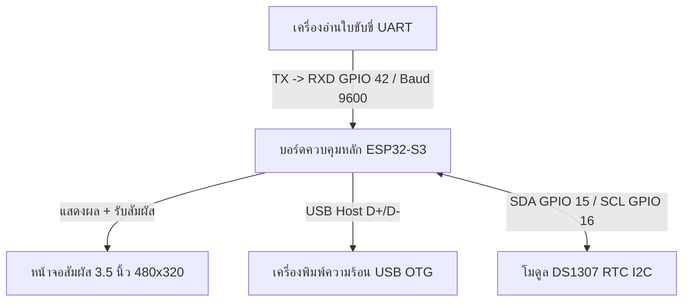
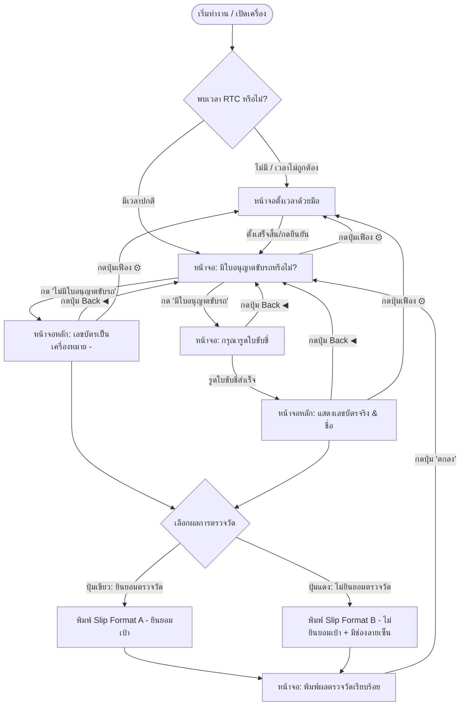

# คู่มือการใช้งานระบบตรวจวัดปริมาณแอลกอฮอล์ ATD3.5-S3 
## (Alcohol Breathalyzer Consent & Printing System)

เอกสารนี้อธิบายรายละเอียดเกี่ยวกับโครงสร้างระบบ การเชื่อมต่ออุปกรณ์ ขั้นตอนการทำงาน และรูปแบบผลลัพธ์ (Slip) ที่พิมพ์ออกมา พร้อมตัวอย่างในการใช้งานจริง ตั้งแต่เริ่มต้นจนเสร็จสิ้นกระบวนการ

---

## 1. ภาพรวมระบบ (System Overview)

**ระบบตรวจวัดปริมาณแอลกอฮอล์ ATD3.5-S3** คือระบบควบคุมและแสดงผลการลงทะเบียนยินยอมตรวจวัดแอลกอฮอล์สำหรับผู้ขับขี่ ทำงานบนบอร์ดไมโครคอนโทรลเลอร์ **ESP32-S3** พร้อมหน้าจอสัมผัสขนาด 3.5 นิ้ว (ความละเอียด 480x320 พิกเซล แบบแนวนอน Landscape) 

ระบบเชื่อมต่อกับอุปกรณ์ภายนอก 3 ส่วนหลักเพื่อทำงานร่วมกันอย่างสมบูรณ์:
1. **เครื่องอ่านใบขับขี่แถบแม่เหล็ก (Magnetic Card Reader)**: ใช้สำหรับรูดใบอนุญาตขับรถเพื่อนำข้อมูลชื่อ-นามสกุล และเลขประจำตัวประชาชน (13 หลัก) เข้าสู่ระบบโดยอัตโนมัติ
2. **เครื่องพิมพ์ความร้อนแบบ USB (USB Thermal Printer)**: ใช้พิมพ์ Slip เพื่อเป็นหลักฐานยืนยันการเป่าตรวจวัด หรือการปฏิเสธการเป่าตรวจวัด
3. **โมดูลนาฬิกาเวลาจริง (DS1307 RTC)**: ใช้เก็บวันและเวลาที่ถูกต้องแม้อุปกรณ์ไม่มีแหล่งจ่ายไฟ เพื่อให้เวลาใน Slip ตรงกับเวลาจริงเสมอ

### โครงสร้างการเชื่อมต่อฮาร์ดแวร์ (Hardware Setup)



> [!IMPORTANT]
> **หมายเหตุการแก้ไขฮาร์ดแวร์พิเศษ:**
> เนื่องจากเครื่องรูดบัตรใช้สัญญาณระดับ TTL 3.3V เชื่อมต่อตรงกับบอร์ด ESP32-S3 โดยไม่มีชิป MAX232 เพื่อกลับระดับสัญญาณ (RS-232 to TTL) สัญญาณ RX ที่เข้ามาจะอยู่ในลักษณะกลับด้าน (Inverted Logic) ระบบซอฟต์แวร์จึงทำการเปิดระบบกลับสัญญาณภายในชิปด้วยคำสั่ง:
> `uart_set_line_inverse(CARD_UART_PORT_NUM, UART_SIGNAL_RXD_INV);`
> ส่งผลให้บอร์ดสามารถอ่านข้อมูลแถบแม่เหล็กจากใบขับขี่ได้ถูกต้อง 100% โดยไม่ต้องใช้ชิปแปลงระดับสัญญาณภายนอก

---

## 2. โครงสร้างและการทำงานภายใน (How It Works)

ระบบพัฒนาขึ้นโดยใช้ระบบปฏิบัติการ **FreeRTOS** บนเฟรมเวิร์ก **ESP-IDF v5.x** ร่วมกับไลบรารีกราฟิก **LVGL v8** มีส่วนประกอบสำคัญดังนี้:

* **UI Engine (LVGL v8)**: ทำหน้าที่ควบคุมและแสดงผลหน้าจอแบบสัมผัส มีฟอนต์ภาษาไทย **Sarabun** ที่ออกแบบขึ้นเฉพาะสำหรับการแสดงผลข้อความภาษาไทยอย่างสวยงามและถูกต้อง (สระและวรรณยุกต์ไม่ซ้อนกัน)
* **Card Reader Task**: ทำหน้าที่สแตนด์บายรอรับข้อมูลจากพอร์ต UART2 (GPIO 42) เมื่อมีการรูดบัตร ระบบจะอ่าน Track 1 เพื่อดึงชื่อ-นามสกุล และอ่าน Track 2 เพื่อตัดตัวเลข 13 หลักของบัตรประชาชนผู้ถือใบอนุญาตขับรถ
* **USB Printer Host**: ESP32-S3 ทำหน้าที่เป็น USB Host คอยตรวจจับการเชื่อมต่อของเครื่องพิมพ์ความร้อนทางพอร์ต USB OTG และส่งรหัสสั่งการพิมพ์ **ESC/POS** แบบภาษาไทย (Code Page 26 / Thaimap) ไปยังเครื่องพิมพ์
* **RTC Sync Engine**: เมื่อเปิดเครื่อง ระบบจะเช็คเวลาจากโมดูล DS1307 RTC ผ่านสาย I2C หากพบว่าเวลาถูกต้อง จะซิงค์เข้าสู่นาฬิกาภายในระบบโดยอัตโนมัติ

---

## 3. ขั้นตอนการทำงานของระบบ (System Workflow)

ระบบมีขั้นตอนการทำงานที่ถูกออกแบบให้กระชับ ปลอดภัย และเข้าใจง่าย ดังแผนภาพด้านล่างนี้:



### รายละเอียดหน้าจอแต่ละขั้นตอน

#### ขั้นตอนที่ 1: หน้าจอตั้งวันเวลา (Time Setting Screen)
* **การทำงาน**: แสดงผลเมื่อเปิดเครื่องครั้งแรกแล้วไม่พบโมดูล RTC หรือนาฬิกายังไม่ได้ถูกตั้งค่า 
* **วิธีใช้งาน**: ผู้ตรวจวัดสามารถกดปุ่มลูกศรขึ้น/ลง **▲/▼** เพื่อแก้ไข ชั่วโมง, นาที, วัน, เดือน, และปี เมื่อตรวจสอบวันเวลาตรงกับปัจจุบันแล้ว ให้กดปุ่ม **Confirm** เพื่อบันทึกเข้าสู่หน่วยความจำและโมดูล RTC ทันที
* **ปุ่มเข้าถึงพิเศษ**: บนหน้าจออื่นๆ จะมีปุ่มรูปเฟือง **⚙** ที่มุมบนขวา ซึ่งหากกดแล้วจะกลับมาหน้านี้เพื่อแก้ไขเวลาได้ตลอดเวลา

#### ขั้นตอนที่ 2: หน้าจอสอบถามใบขับขี่ (Ask Card Screen)
* **การทำงาน**: หน้าจอนี้จะถามผู้ถูกตรวจว่า **"มีใบอนุญาตขับรถหรือไม่?"**
* **ปุ่มควบคุม**:
  * 🟢 **"มีใบอนุญาตขับรถ" (ปุ่มสีเขียว)**: กดในกรณีที่ผู้ถูกตรวจพกใบอนุญาตขับรถมาด้วย ระบบจะนำเข้าสู่หน้าจอรอรูดบัตร (Scan Screen)
  * 🔴 **"ไม่มีใบอนุญาตขับรถ" (ปุ่มสีแดง)**: กดในกรณีที่ไม่ได้พกบัตรมา ระบบจะข้ามไปหน้าจอหลักทันที โดยข้อมูลบัตรจะถูกระบุเป็นเครื่องหมายขีด (`-`) และแสดงบน Slip พิมพ์ว่า `(ไม่มีใบอนุญาตขับรถ)`

#### ขั้นตอนที่ 3: หน้าจอรอรูดใบอนุญาตขับรถ (Scan Screen)
* **การทำงาน**: หน้าจอนี้แสดงข้อความ **"กรุณารูดใบอนุญาตขับรถ"** พร้อมไอคอนรูปบัตร 
* **การดำเนินการ**: ในขั้นตอนนี้ ระบบจะรอจนกว่าจะมีการรูดใบขับขี่ผ่านเครื่องอ่านจริงเท่านั้น จึงจะผ่านไปยังขั้นตอนต่อไปได้ ช่วยป้องกันการกดข้ามโดยไม่ได้รูดบัตรจริง
* **ทางออก**: มีปุ่มลูกศรย้อนกลับ **◀** ที่มุมบนซ้าย เพื่อใช้ย้อนกลับไปหน้าถามบัตรในกรณีที่เปลี่ยนใจ

#### ขั้นตอนที่ 4: หน้าจอหลักและสถานะเครื่องพิมพ์ (Main Screen)
* **การทำงาน**: แสดงข้อมูลผู้ถูกตรวจวัด (เลขบัตรประชาชน 13 หลัก และ ชื่อ-นามสกุล ที่อ่านมาจากแถบแม่เหล็ก หรือแสดงเครื่องหมายขีด `-` หากเลือกไม่มีบัตร)
* **สถานะความพร้อมเครื่องพิมพ์**: แสดงผลที่มุมล่างซ้ายแบบ Real-time:
  * 🟢 **เครื่องพิมพ์พร้อมแล้ว**: แสดงไฟสถานะสีเขียว หมายความว่าเครื่องพิมพ์ USB เชื่อมต่อและเปิดเครื่องอยู่
  * 🔴 **เครื่องพิมพ์ไม่พร้อม**: แสดงไฟสถานะสีแดง หมายความว่าเครื่องพิมพ์ไม่ได้เชื่อมต่อ หรือไม่ได้เปิดเครื่อง (หากกดยืนยันผลในสถานะนี้ หน้าจอจะแจ้งเตือนว่า `"No Printer!"` และจะไม่พิมพ์ผล)
* **ปุ่มเลือกการยินยอม**:
  * 🟢 **ยินยอมตรวจวัด (ปุ่มสีเขียว)**: ผู้ถูกตรวจวัดยินยอมที่จะให้ความร่วมมือในการเป่าแอลกอฮอล์
  * 🔴 **ไม่ยินยอมตรวจวัด (ปุ่มสีแดง)**: ผู้ถูกตรวจวัดปฏิเสธการเป่าแอลกอฮอล์

#### ขั้นตอนที่ 5: หน้าจอยืนยันการพิมพ์สำเร็จ (Confirm Screen)
* **การทำงาน**: แสดงหลังจากพิมพ์ Slip เรียบร้อยแล้ว แสดงข้อความ **"พิมพ์ผลตรวจวัดเรียบร้อย"** พร้อมปุ่ม **"ตกลง"** 
* **วิธีใช้งาน**: ผู้ตรวจวัดกดปุ่ม **"ตกลง"** เพื่อล้างค่าข้อมูล (Clear State) ของคนก่อนหน้า และกลับไปที่หน้าจอเริ่มแรกเพื่อเตรียมตัวตรวจคนถัดไปทันที

---

## 4. รูปแบบผลลัพธ์ของเครื่องพิมพ์ (Printer Slip Outputs)

ผลลัพธ์จากการสั่งพิมพ์จะแบ่งออกเป็น 4 รูปแบบ ขึ้นอยู่กับ **"การพกบัตร"** และ **"ความยินยอมตรวจวัด"** ดังรายละเอียดด้านล่าง:

### 1. Slip Format A - มีใบขับขี่ + ยินยอมตรวจวัด (Report 1)
พิมพ์เมื่อรูดบัตรสำเร็จ และผู้ถูกตรวจยินยอมเป่าแอลกอฮอล์

```text
================================
รายงานผลการตรวจวัดปริมาณแอลกอฮอล์

เลขใบอนุญาตขับรถผู้ถูกตรวจวัด :
3159800015969

ชื่อผู้ถูกตรวจวัด :
MR TIN SHUNIJTANAKUN

วันที่ : 01/06/2026
เวลา : 18:05:22
================================
ผู้ถูกตรวจวัด
**** ยอมรับการตรวจวัด ****
================================
```

### 2. Slip Format B - มีใบขับขี่ + ไม่ยินยอมตรวจวัด (Report 2)
พิมพ์เมื่อรูดบัตรสำเร็จ แต่ผู้ถูกตรวจปฏิเสธไม่ยินยอมเป่าแอลกอฮอล์ (จะมีส่วนท้ายสำหรับเซ็นชื่อกำกับเป็นหลักฐานทางกฎหมาย)

```text
================================
รายงานผลการตรวจวัดปริมาณแอลกอฮอล์

เลขใบอนุญาตขับรถผู้ถูกตรวจวัด :
3159800015969

ชื่อผู้ถูกตรวจวัด :
MR TIN SHUNIJTANAKUN

ผู้ถูกตรวจวัด
**** ปฏิเสธการตรวจวัด ****

วันที่ : 01/06/2026
เวลา : 18:05:40
================================
................................
ชื่อผู้ถูกตรวจวัด:


................................
ลายเซ็นต์ผู้ถูกตรวจวัด:


................................
ชื่อผู้ตรวจวัด:


................................
ลายเซ็นต์ผู้ตรวจวัด:
================================
```

### 3. Slip Format A - ไม่มีใบขับขี่ + ยินยอมตรวจวัด (Report 3)
พิมพ์เมื่อไม่ได้รูดบัตร (ไม่มีใบขับขี่) และผู้ถูกตรวจยินยอมเป่าแอลกอฮอล์

```text
================================
รายงานผลการตรวจวัดปริมาณแอลกอฮอล์

เลขใบอนุญาตขับรถผู้ถูกตรวจวัด :
(ไม่มีใบอนุญาตขับรถ)

ชื่อผู้ถูกตรวจวัด :
(ไม่มีใบอนุญาตขับรถ)

วันที่ : 01/06/2026
เวลา : 18:06:12
================================
ผู้ถูกตรวจวัด
**** ยอมรับการตรวจวัด ****
================================
```

### 4. Slip Format B - ไม่มีใบขับขี่ + ไม่ยินยอมตรวจวัด (Report 4)
พิมพ์เมื่อไม่ได้รูดบัตร (ไม่มีใบขับขี่) และผู้ถูกตรวจปฏิเสธไม่ยินยอมเป่าแอลกอฮอล์

```text
================================
รายงานผลการตรวจวัดปริมาณแอลกอฮอล์

เลขใบอนุญาตขับรถผู้ถูกตรวจวัด :
(ไม่มีใบอนุญาตขับรถ)

ชื่อผู้ถูกตรวจวัด :
(ไม่มีใบอนุญาตขับรถ)

ผู้ถูกตรวจวัด
**** ปฏิเสธการตรวจวัด ****

วันที่ : 01/06/2026
เวลา : 18:06:35
================================
................................
ชื่อผู้ถูกตรวจวัด:


................................
ลายเซ็นต์ผู้ถูกตรวจวัด:


................................
ชื่อผู้ตรวจวัด:


................................
ลายเซ็นต์ผู้ตรวจวัด:
================================
```

---

## 5. การแก้ไขปัญหาเบื้องต้น (Troubleshooting Guide)

| ปัญหาที่พบ | สาเหตุที่เป็นไปได้ | วิธีการแก้ไข |
|---|---|---|
| ❌ บนจอขึ้นเตือน **"No Printer!"** หรือไฟเครื่องพิมพ์เป็นสีแดง 🔴 | เครื่องพิมพ์ไม่ได้ต่อ หรือเครื่องพิมพ์ถูกปิดการใช้งาน หรือกระแสไฟเลี้ยงจากพอร์ต USB ไม่เพียงพอ | 1. ตรวจสอบให้แน่ใจว่าได้ต่อสายเครื่องพิมพ์พิมพ์เข้าพอร์ต USB OTG แล้ว<br>2. เปิดสวิตช์เครื่องพิมพ์ความร้อน<br>3. ตรวจสอบระดับไฟ 5V ที่ป้อนเข้าบอร์ดควบคุม |
| ❌ บนจอขึ้นเตือน **"Print Failed!"** | เครื่องพิมพ์ได้รับคำสั่งแต่ไม่สามารถทำตามขั้นตอนได้ เช่น กระดาษพิมพ์หมด หรือกระดาษติด | 1. เปิดฝาเครื่องพิมพ์และตรวจสอบว่ายังมีม้วนกระดาษความร้อนอยู่หรือไม่<br>2. จัดกระดาษให้ตรงช่องและปิดฝาให้แน่น จากนั้นทดลองกดยืนยันใหม่อีกครั้ง |
| ❌ รูดใบขับขี่แล้วหน้าจอไม่เปลี่ยนไปหน้าหลัก (ไม่มีข้อมูลขึ้น) | 1. รูดบัตรกลับด้าน หรือรูดเร็ว/ช้าเกินไป<br>2. สายสัญญาณของเครื่องอ่านต่อไม่ถูกต้อง | 1. ตรวจสอบด้านแถบแม่เหล็กของใบขับขี่ให้หันไปทิศทางที่เครื่องอ่านกำหนด<br>2. รูดผ่านเครื่องอ่านด้วยความเร็วสม่ำเสมอ<br>3. ตรวจสอบว่าสาย TXD ของเครื่องอ่านต่อเข้ากับ GPIO 42 ของ ESP32-S3 ถูกต้องแน่นหนา |
| ❌ วันและเวลาเพี้ยน หรือถอดปลั๊กแล้วเวลาถูกรีเซ็ตกลับไปเป็นค่าเริ่มต้น | 1. ไม่พบโมดูล DS1307 RTC<br>2. แบตเตอรี่สำรอง (CR2032) ในบอร์ด RTC หมดอายุ | 1. ตรวจสอบสายเชื่อมต่อ SDA (GPIO 15) และ SCL (GPIO 16) ของโมดูล RTC<br>2. ทำการตั้งเวลาใหม่ที่หน้าจอเวลา และกด Confirm เพื่อบันทึก<br>3. เปลี่ยนแบตเตอรี่เหรียญ CR2032 บนโมดูล RTC |

---
*จัดทำเอกสารเพื่อคู่มือการปฏิบัติงานและการดูแลรักษาระบบอย่างยั่งยืน*
