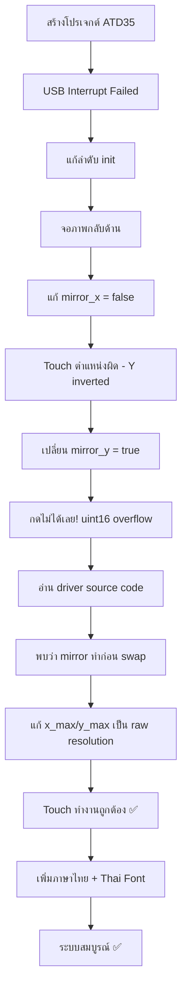

# 🔧 ATD3.5-S3 — ปัญหาที่เจอและวิธีแก้ไข

## สารบัญ

1. [USB Interrupt Allocation Failed](#1-usb-interrupt-allocation-failed)
2. [จอภาพกลับด้าน (Display Mirrored)](#2-จอภาพกลับด้าน-display-mirrored)
3. [ตำแหน่ง Touch ไม่ตรง — กดเลข 2 แสดง 0](#3-ตำแหน่ง-touch-ไม่ตรง--กดเลข-2-แสดง-0)
4. [กด Touch ไม่ได้เลย (mirror_y=true)](#4-กด-touch-ไม่ได้เลย-mirrortrue)
5. [กด Touch ไม่ได้เลย (x_max/y_max ผิด)](#5-กด-touch-ไม่ได้เลย-xmaxymax-ผิด)
6. [LVGL ไม่แสดงภาษาไทย](#6-lvgl-ไม่แสดงภาษาไทย)
7. [Build Error: lvgl/lvgl.h not found](#7-build-error-lvgllvglh-not-found)
8. [Implicit Function Declaration: lv_event_get_active_btn](#8-implicit-function-declaration)
9. [Serial Port Locked — Flash ไม่ได้](#9-serial-port-locked--flash-ไม่ได้)

---

## 1. USB Interrupt Allocation Failed

### อาการ
```
E (713) intr_alloc: No free interrupt inputs for USB interrupt (flags 0x802)
E (713) usb_printer: usb_host_install failed: ESP_ERR_NOT_FOUND
ESP_ERROR_CHECK failed: esp_err_t 0x105 (ESP_ERR_NOT_FOUND)
```

### สาเหตุ
ESP32-S3 มี interrupt slot จำกัด เมื่อ driver อื่น (SPI, I2C, LCD) จอง interrupt ไปหมดแล้ว USB Host จะไม่มี interrupt ให้ใช้

### วิธีแก้ไข
เปลี่ยนลำดับ initialization ใน `main.c` — ให้ USB Host init **ก่อน** display/touch drivers
ลด interrupt flags requirement ของ USB driver

**ไฟล์:** [main.c](file:///C:/Antigravity/ESP32/ATD35/main/main.c)

---

## 2. จอภาพกลับด้าน (Display Mirrored)

### อาการ
ภาพบนจอแสดงผลกลับซ้าย-ขวา (mirrored horizontally)

### สาเหตุ
ค่า `mirror_x = true` ใน `esp_lcd_panel_mirror()` ทำให้ LCD กลับภาพแนวนอน

### วิธีแก้ไข
```c
// display.c — ก่อนแก้ไข
bool mirror_x = true;   // ❌ ภาพกลับด้าน

// display.c — หลังแก้ไข
bool mirror_x = false;  // ✅ ภาพปกติ
```

**ไฟล์:** [display.c](file:///C:/Antigravity/ESP32/ATD35/main/display.c) บรรทัด 63

---

## 3. ตำแหน่ง Touch ไม่ตรง — กดเลข 2 แสดง 0

### อาการ
- กดเลข **2** (แถวบน) → แสดง **0** (แถวล่าง)
- กดเลข **1** → ได้ **CLR**
- กดเลข **3** → ได้ **ENTER**

**สรุป:** คอลัมน์ถูกต้อง แต่แถวกลับหัว (Y-axis inverted)

### สาเหตุ
Touch configuration `swap_xy=true, mirror_x=true, mirror_y=false` ทำให้แกน Y ยังกลับด้านอยู่ เพราะ `x_max` ที่ใช้ในการ mirror มีค่าผิด (ดูปัญหา #5)

### การวิเคราะห์
ศึกษา ArtronShop reference library [Touch.cpp](file:///C:/Antigravity/ESP32/ATD3.5-S3_Library/src/Touch.cpp):
```cpp
// ArtronShop rotation 0 mapping:
*cx = y;           // swap X ↔ Y
*cy = 320 - x;     // invert Y after swap
```

### วิธีแก้ไข
ปัญหาที่แท้จริงคือ `x_max/y_max` ไม่ถูกต้อง (ดูปัญหา #5) ไม่ใช่ mirror flags

---

## 4. กด Touch ไม่ได้เลย (mirror_y=true)

### อาการ
เมื่อเปลี่ยน `mirror_y = true` (พยายามแก้ปัญหา #3) → touch ไม่ตอบสนองเลย

### สาเหตุ
**ค่า `y_max` ผิด!** โค้ดเดิมตั้ง `y_max = 320` (swap_xy ? LCD_H_RES : LCD_V_RES)
แต่ FT6336U raw Y range คือ 0–479

เมื่อ driver ทำ `mirror_y`: `y' = 320 - raw_y`
- ถ้า `raw_y = 400` → `y' = 320 - 400 = -80`
- เนื่องจากเป็น `uint16_t` → **y' = 65,456** (overflow!)
- ค่าพิกัดหลุดออกนอกจอ → LVGL ไม่รับ → **กดไม่ได้เลย**

### วิธีแก้ไข
แก้ `x_max/y_max` ให้ตรงกับ raw resolution ของ touch controller (ดูปัญหา #5)

---

## 5. กด Touch ไม่ได้เลย (x_max/y_max ผิด) ⭐ สาเหตุหลัก

### อาการ
Touch ไม่ตอบสนอง หรือตำแหน่งผิดทุกกรณี

### สาเหตุหลัก
**ค่า `x_max` และ `y_max` ถูกตั้งเป็น post-swap display resolution แทนที่จะเป็น raw touch panel resolution**

#### การค้นพบ
อ่านซอร์สโค้ดของ driver จริงใน [esp_lcd_touch.c](file:///C:/Antigravity/ESP32/ATD35/managed_components/espressif__esp_lcd_touch/esp_lcd_touch.c) บรรทัด 89-106 พบว่า:

```c
// ลำดับการประมวลผลจริงของ driver:
// 1. mirror_x: x = x_max - x      ← ใช้ x_max
// 2. mirror_y: y = y_max - y      ← ใช้ y_max
// 3. swap_xy:  swap(x, y)         ← สลับหลังสุด
```

**ลำดับคือ Mirror ก่อน → Swap ทีหลัง**

ดังนั้น `x_max` และ `y_max` ต้องเป็นค่า **raw ของ touch controller (ก่อน swap)** ไม่ใช่ค่าหลัง swap!

| ค่า | เดิม (ผิด) | ที่ถูกต้อง |
|---|---|---|
| `x_max` | `480` (LCD_V_RES, post-swap width) | **`320`** (LCD_H_RES, raw X) |
| `y_max` | `320` (LCD_H_RES, post-swap height) | **`480`** (LCD_V_RES, raw Y) |

### วิธีแก้ไข
```c
// display.c — ก่อนแก้ไข
esp_lcd_touch_config_t tp_cfg = {
    .x_max = swap_xy ? LCD_V_RES : LCD_H_RES,  // ❌ 480 (post-swap)
    .y_max = swap_xy ? LCD_H_RES : LCD_V_RES,  // ❌ 320 (post-swap)
};

// display.c — หลังแก้ไข
esp_lcd_touch_config_t tp_cfg = {
    .x_max = LCD_H_RES,   // ✅ 320 (raw touch X)
    .y_max = LCD_V_RES,   // ✅ 480 (raw touch Y)
};
```

พร้อม mirror configuration ที่ถูกต้อง:
```c
esp_lcd_touch_set_swap_xy(touch, true);
esp_lcd_touch_set_mirror_x(touch, true);   // x' = 320 - raw_x
esp_lcd_touch_set_mirror_y(touch, false);
// หลัง swap: final_x = raw_y, final_y = 320 - raw_x ✓
```

**ไฟล์:** [display.c](file:///C:/Antigravity/ESP32/ATD35/main/display.c) บรรทัด 78-97

### บทเรียน
> ⚠️ **เมื่อ driver ทำ mirror ก่อน swap — ค่า `x_max`/`y_max` ต้องเป็น raw resolution ของ touch controller
> ไม่ใช่ post-swap display resolution**

---

## 6. LVGL ไม่แสดงภาษาไทย

### อาการ
ต้องการแสดง "บัตรประชาชน" บนจอ LVGL แต่ font Montserrat ในตัวไม่รองรับอักษรไทย

### สาเหตุ
LVGL built-in fonts (Montserrat) รองรับเฉพาะ Latin/ASCII, ไม่มี Thai Unicode block (U+0E00–U+0E7F)

### วิธีแก้ไข

**ขั้นตอน:**

1. ดาวน์โหลดฟอนต์ Thai ที่รองรับ: **Sarabun Bold** จาก Google Fonts
2. แปลงเป็น LVGL C array ด้วย `lv_font_conv`:
   ```bash
   npx -y lv_font_conv \
     --font Sarabun-Bold.ttf \
     -r 0x20-0x7F,0x0E00-0x0E7F \
     --size 16 --bpp 4 \
     --format lvgl \
     -o font_thai_16.c \
     --no-compress \
     --lv-font-name "font_thai_16"
   ```
3. แก้ include path ในไฟล์ที่ generate: `lvgl/lvgl.h` → `lvgl.h`
4. เพิ่มไฟล์เข้า `CMakeLists.txt`
5. ใช้ในโค้ด:
   ```c
   LV_FONT_DECLARE(font_thai_16);
   lv_obj_set_style_text_font(label, &font_thai_16, 0);
   lv_label_set_text(label, "บัตรประชาชน");  // UTF-8
   ```

**ไฟล์:** [font_thai_16.c](file:///C:/Antigravity/ESP32/ATD35/main/font_thai_16.c), [font_thai_24.c](file:///C:/Antigravity/ESP32/ATD35/main/font_thai_24.c)

---

## 7. Build Error: lvgl/lvgl.h not found

### อาการ
```
fatal error: lvgl/lvgl.h: No such file or directory
```

### สาเหตุ
ไฟล์ font ที่ `lv_font_conv` generate มี `#include "lvgl/lvgl.h"` แต่ ESP-IDF component manager ใช้ path `lvgl.h` โดยตรง (ไม่มี prefix `lvgl/`)

### วิธีแก้ไข
เปลี่ยน include ในไฟล์ font:
```c
// ก่อน
#include "lvgl/lvgl.h"   // ❌

// หลัง
#include "lvgl.h"        // ✅
```

หรือใช้ `--lv-include lvgl.h` ตอน generate font

**ไฟล์:** [font_thai_16.c](file:///C:/Antigravity/ESP32/ATD35/main/font_thai_16.c) บรรทัด 10

---

## 8. Implicit Function Declaration

### อาการ
```
error: implicit declaration of function 'lv_event_get_active_btn';
       did you mean 'lv_msgbox_get_active_btn'? [-Werror=implicit-function-declaration]
```

### สาเหตุ
ฟังก์ชัน `lv_event_get_active_btn()` ไม่มีใน LVGL 8.3 — เป็น API จากเวอร์ชันเก่าหรือคนละ variant

### วิธีแก้ไข
ใช้ `lv_btnmatrix_get_selected_btn()` แทน:
```c
// ก่อน — ไม่มีใน LVGL 8.3
uint32_t id = lv_event_get_active_btn(e);

// หลัง — API ที่ถูกต้อง
uint16_t id = lv_btnmatrix_get_selected_btn(obj);
```

**ไฟล์:** [ui_screens.c](file:///C:/Antigravity/ESP32/ATD35/main/ui_screens.c) บรรทัด 67

---

## 9. Serial Port Locked — Flash ไม่ได้

### อาการ
```
serial.serialutil.SerialException: could not open port 'COM6':
PermissionError(13, 'Access is denied.', None, 5)
```

### สาเหตุ
Serial monitor (Putty, `idf.py monitor`, หรือ Python process) ค้าง lock COM6 อยู่ ทำให้ `esptool.py` เปิด port ไม่ได้

### วิธีแก้ไข
ปิด serial monitor ก่อน flash:
```powershell
# วิธีที่ 1: ปิด Putty
Stop-Process -Name putty -Force

# วิธีที่ 2: ปิด Python processes ที่ lock serial port
Get-Process python* | Stop-Process -Force

# วิธีที่ 3: ตรวจสอบ process ที่ใช้ COM6
# ใน Device Manager → Ports → ดูว่า process ไหน lock อยู่
```

### บทเรียน
> ⚠️ ต้อง **ปิด serial monitor ทุกครั้งก่อน flash** — esptool ต้องการ exclusive access ไป COM port

---

## 📋 สรุปลำดับเวลาการแก้ปัญหา


